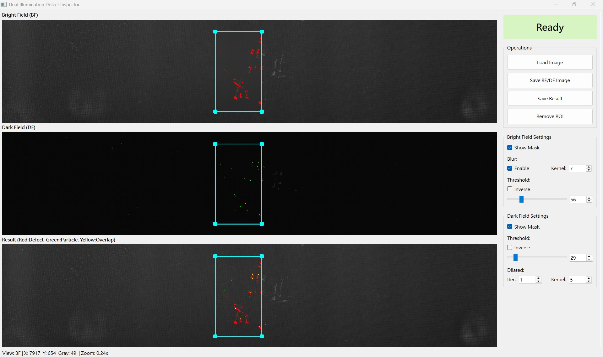

# dual-illumination-defect-inspector
Dual-illumination AOI tool for bright-field / dark-field defect inspection with synchronized viewers, parameter tuning UI, and BF/DF image processing pipelines.

